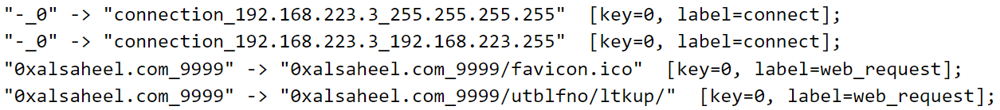
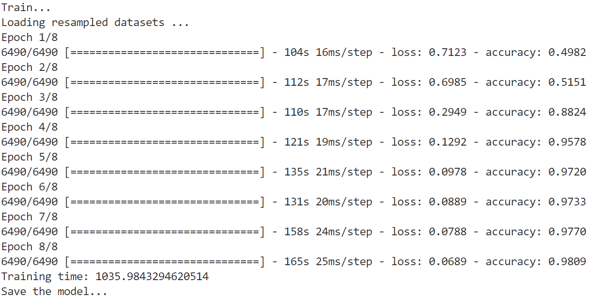
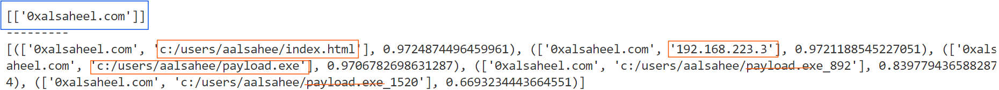

# ATLAS复现

* 因果图优化可以消融实验，确认优化效果

## 环境配置


```
conda create -n tensorflow python=3.7
conda activate tensorflow
pip install tensorflow==2.3.0
pip install keras==2.4.3
pip install fuzzywuzzy==0.18.0
pip install matplotlib==2.2.5
pip install numpy==1.16.6
pip install networkx==2.2
pip install scikit-learn

conda install -c conda-forge python-levenshtein
```

## 日志预处理 preprocess.py

三类日志统一格式合并。

格式：`时间戳，查询域名，解析的IP地址，http请求/响应，http请求/响应信息（多项），系统日志条目（网络连接和文件操作），日志类型和攻击标签`

* DNS日志：标签LD

  ```
  22323533,play.google.com,216.58.194.46,,,,,,,,,,,,,,,,,-LD-
  22323538,0xalsaheel.com,192.168.223.3,,,,,,,,,,,,,,,,,-LD+
  ```

* http日志：标签LB

  ```
  22319930,,,,,,,,,,response,,,302,0xalsaheel.com,,0xalsaheel.com:9999/ripleeszw,,,-LB+
  ```

* 系统日志：标签LA

  ```
  22323623,,,1096,2536,c:/windows/system32/searchprotocolhost.exe,,,,,,,,,,,,file_read_control,c:/users/aalsahee/payload.exe,-LA+
  ```

  

## 因果图生成 graph_generator.py

> `networkx.MultiDiGraph` 是 NetworkX 库中的一个类，用于表示有向多重图（Directed Multigraph）。NetworkX 是一个用 Python 编写的用于创建、操作和研究复杂网络的结构、动态和功能的库。

1. 获取 user_artifact，是标记的恶意IP
2. 构建因果图
   * DNS日志：节点是域名（domain_name）或IP地址（IP_Address）
     * 域名 $\to$ IP地址（表示解析，标签"resolve"）
   * http日志：域名（domain_name）、Web对象（web_object）和IP地址（IP_Address）
     * Web对象 $\to$ 域名（表示Web请求，标签“web\_request”）
     * 域名 $\to$ IP地址（表示解析，标签"resolve"）
     * web对象 $\to$ web对象（表示引用，标签“refer”）
   * 系统日志：进程（process）、文件（file）、网络连接（connection）、IP地址（IP_Address）、会话（session）
     *  进程 $\to$ 文件（表示执行/读取/写入/删除，标签"executed"/"read"/"write"/"delete"）
     * 进程 $\to$ 进程（表示fork，标签“fork”）
     * IP地址 $\to$ 进程/网络连接（表示连接远程IP，标签“connected\_remote\_ip”）
     * 网络连接 $\to$ 进程（表示连接，标签"connect"）
     * 会话 $\to$ 会话（表示套接字发送，标签"sock\_send"）
     * 会话 $\to$ 进程（表示绑定，标签"bind"）
     * 从IP $\to$ 会话，从会话 $\to$ 进程（表示连接会话，标签"connected\_session"）

ATLAS 使用三种技术进行因果图优化：

1. 消除了攻击节点（在模型学习中）或攻击症状节点（在攻击调查中）无法到达的所有节点和边。
2. 删除重复边，只保存 source 到 target 的最早触发的边。
3. 如果某些节点和边表示相同类型的事件，则合并它们。



构建出的有向图形式如上，结点类型仅用于构建有向边，有向图中只保留结点内容和有向边类型标签。

## 邻域图提取 graph_reader.py

不区分攻击非攻击实体，暴力枚举所有结点的邻域图。

## 序列构建和模型学习 atlas.py

* 邻域图中结点按时间排序构成事件

* 攻击事件是以攻击实体开始或结束的的事件
* 所有攻击事件构成的序列是攻击序列
* 非攻击序列则在攻击序列构建过程中添加非攻击结点，人为构造出
* 序列词形还原/抽象归并



